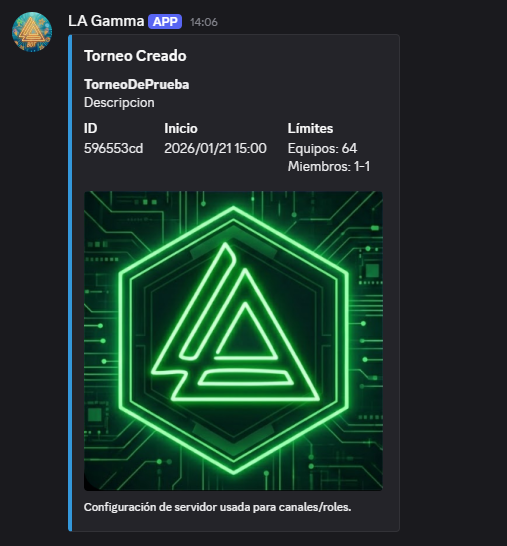
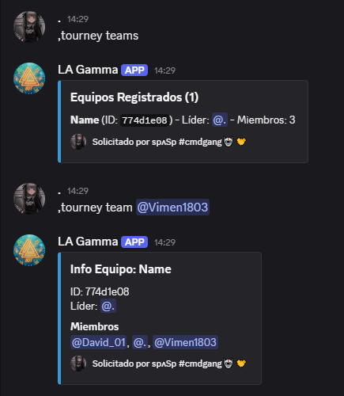
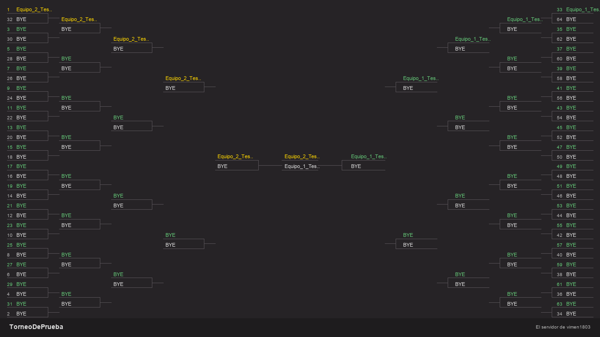
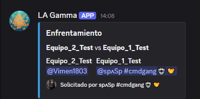
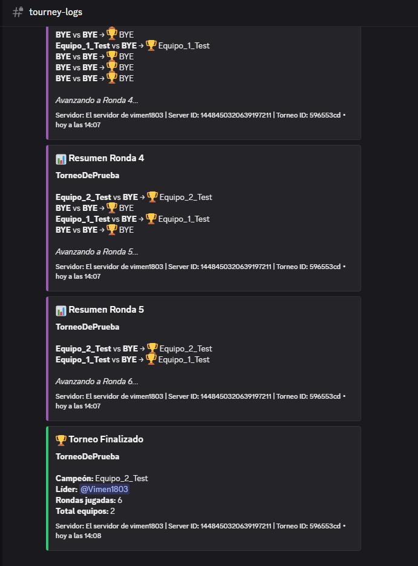
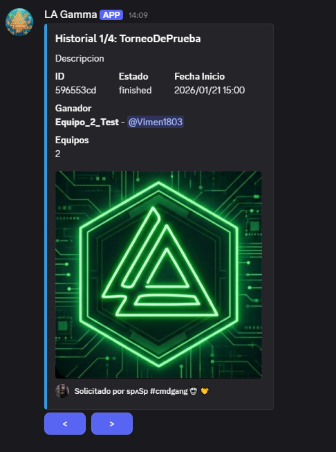

<div align="center">
  <div align="center">
    
    <h1 style="display: inline-block; vertical-align: middle; margin: 0;">Tourney Bot</h1>
  </div>

  <p align="center">
    <b>Bot de Discord para gestión de torneos con sistema de brackets automáticos, equipos y registro de partidas.</b>
  </p>

  <p align="center">
    
    
    <a href="http://tourneydoc.victormenjon.es"></a>
  </p>
</div>

## Características

<details>
<summary><b>Creación y gestión de torneos</b></summary>
<br>
Crea torneos personalizados definiendo fecha, hora y límites de participantes.
<br><br>

</details>

<details>
<summary><b>Sistema de equipos con líder y miembros</b></summary>
<br>
Los usuarios pueden registrar sus propios equipos, invitar miembros y gestionar su participación.
<br><br>

</details>

<details>
<summary><b>Generación automática de brackets visuales</b></summary>
<br>
El bot genera automáticamente una imagen del bracket del torneo que se actualiza ronda tras ronda.
<br><br>

</details>

<details>
<summary><b>Canales de partida automáticos</b></summary>
<br>
Se crean canales privados automáticamente para cada enfrentamiento, dando permisos solo a los equipos involucrados.
<br><br>

</details>

<details>
<summary><b>Sistema de logs para seguimiento</b></summary>
<br>
Registro detallado de todas las acciones importantes del torneo en un canal dedicado.
<br><br>

</details>

<details>
<summary><b>Historial de torneos</b></summary>
<br>
Consulta el historial de torneos pasados, ganadores y participantes.
<br><br>

</details>

---

## Comandos de Usuario

| Comando                                     | Descripción                                            |
| ------------------------------------------- | ------------------------------------------------------ |
| `,tourney help`                             | Muestra la ayuda de comandos                           |
| `,tourney register <nombre> <@miembros...>` | Registra un equipo en el torneo activo                 |
| `,tourney invite <@usuario>`                | Invita a un usuario a tu equipo (solo líder)           |
| `,tourney info [id_torneo]`                 | Muestra información del torneo activo o uno específico |
| `,tourney teams [id_torneo]`                | Lista los equipos registrados                          |
| `,tourney team <id_equipo>`                 | Muestra información detallada de un equipo             |
| `,tourney historial`                        | Muestra torneos anteriores                             |
| `,tourney link`                             | Enlace de invitación del bot                           |
| `,tourney bug <descripción>`                | Reporta un bug o problema                              |

---

## Comandos de Administrador

### Gestión de Torneos

| Comando                       | Descripción                           |
| ----------------------------- | ------------------------------------- |
| `,tourney create <args>`      | Crea un nuevo torneo                  |
| `,tourney start [id_torneo]`  | Inicia el torneo y genera brackets    |
| `,tourney delete <id_torneo>` | Elimina un torneo de la base de datos |

#### Formato de creación:

```
,tourney create Nombre | Descripción | Fecha (YYYY-MM-DD) | Hora (HH:MM) | MaxEquipos | MinMiembros | MaxMiembros
```

> Adjunta una imagen para el banner del torneo

### Configuración del Servidor

| Comando                             | Descripción                                |
| ----------------------------------- | ------------------------------------------ |
| `,tourney settings`                 | Ver configuración actual                   |
| `,tourney set category <id>`        | Configura la categoría para canales        |
| `,tourney set bracket <id_canal>`   | Canal donde se envían los brackets         |
| `,tourney set lobby <id_canal>`     | Canal de lobby/registro                    |
| `,tourney set bot_admin <id_canal>` | Canal de administración                    |
| `,tourney set logs [id_canal]`      | Toggle logs ON/OFF. Con ID establece canal |

### Gestión de Roles

| Comando                        | Descripción                      |
| ------------------------------ | -------------------------------- |
| `,tourney roles`               | Ver roles con permisos de admin  |
| `,tourney roles add <@rol>`    | Añade un rol a los permitidos    |
| `,tourney roles remove <@rol>` | Elimina un rol de los permitidos |

### Gestión de Equipos

| Comando                                 | Descripción                      |
| --------------------------------------- | -------------------------------- |
| `,tourney kick <id_torneo> <id_equipo>` | Expulsa un equipo del torneo     |
| `,tourney set winner <@miembro>`        | Define el ganador de una partida |

---

## Sistema de Logs

Si los logs están habilitados (`tourney set logs`), el bot enviará notificaciones de:

| Evento               | Color      |
| -------------------- | ---------- |
| 🏆 Torneo Creado     | 🟢 Verde   |
| 🚀 Torneo Iniciado   | 🟢 Verde   |
| 🏆 Torneo Finalizado | 🟢 Verde   |
| 👥 Equipo Creado     | 🔵 Azul    |
| ➕ Miembro Unido     | 🔵 Azul    |
| 🗑️ Equipo Eliminado  | 🟠 Naranja |
| 🗑️ Torneo Eliminado  | 🟠 Naranja |
| 📊 Resumen de Ronda  | 🟣 Morado  |
| 🐛 Bug Reportado     | 🔴 Rojo    |
| 📬 MD enviado        | 🟪 Rosa    |

---

## Instalación

1. Clona el repositorio

```bash
git clone https://github.com/tu-usuario/tourney-bot.git
```

2. Instala las dependencias

```bash
pip install discord.py motor aiohttp pillow
```

3. Configura `config.py` con tus credenciales

```python
BOT = "tu_token_aquí"
PREFIX = ","
URL_BASE_1 = "tu_mongodb_uri"
ERROR_CHANNEL: int = tu_id_canal_errores
LOG_CHANNEL: int = tu_id_canal_logs
BUG_CHANNEL: int = tu_id_canal_bugs
```

4. Ejecuta el bot

```bash
python main.py
```

---

## Estructura del Proyecto

```
Tourney/
├── main.py           # Archivo principal
├── config.py         # Configuración
├── image.png         # Logo del bot
├── cogs/
│   └── tourney.py    # Comandos del torneo
└── utils/
    ├── db.py         # Gestión de base de datos
    └── visual.py     # Generación de brackets
```

---

## Requisitos

- Python 3.10+
- MongoDB
- discord.py 2.0+
- Pillow (PIL)
- motor (async MongoDB)

---

<div align="center">
  
## 👨‍💻 Autor

**Victor Menjon**

[](https://victormenjon.es)
[](https://github.com/vimen1803)
[](mailto:victormnjfan@gmail.com)

---

Desarrollado con ❤️ para facilitar la gestión de torneos

_v1.3.0 | Enero 2026_

</div>
